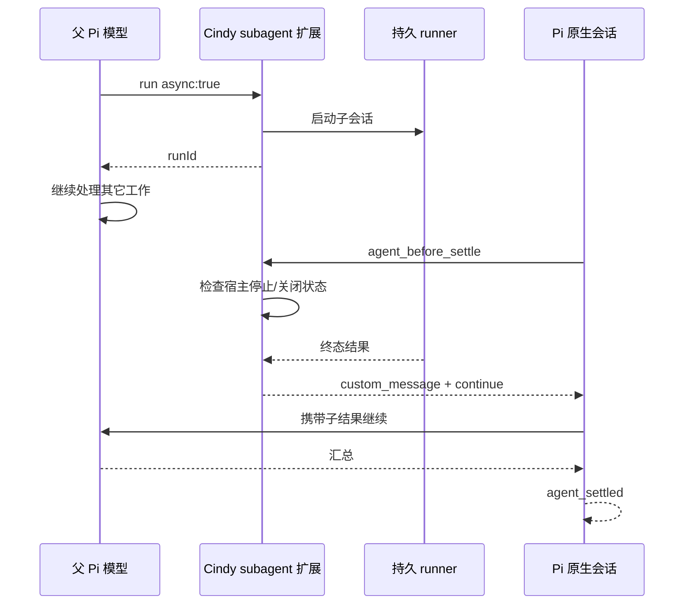

# Pi 子代理：委派、控制与结果收口

核对版本：Cindy `5888d140db`；Pi 原生运行时 `1.0.2`。

## 范围

这里讨论父 Pi 模型调用 `subagent` 后启动的独立 Pi 子会话。实现入口是
`cindy-subagent-source.ts`、`cindy-subagent-runner-source.ts`、
`pi-subagent-runs.ts` 和 `PiAgent`。Orca 的跨 Agent 协作、伙伴委派及其 UI
不构成本工具能力的证据。

沿用 Cindy 的持久 runner、原生 RPC、独立 session、审批转发和现有子代理卡。
模型控制与界面控制共用同一份持久状态和 resume 实现。
子代理详情的可选 `resultReady` 透传到本机与设备互联控制卡：显式 `false` 时中间输出不阻止
插话，`true` 时改为排队；旧宿主或 runner 缺少该字段时，界面保留按输出判断的回退。

## 对标与取舍

对照社区 [pi-subagents 工具契约](https://github.com/nicobailon/pi-subagents/blob/main/docs/tool-reference.md)、
[扩展生命周期](https://github.com/nicobailon/pi-subagents/blob/main/src/extension/index.ts) 和
[后台通知](https://github.com/nicobailon/pi-subagents/blob/main/src/runs/background/notify.ts)。
社区包的 main 会继续变化；本文采用的原则是可定位子代理、明确区分插话与续跑、
后台结果可靠进入父模型、投递后才确认消费。

| 环节 | 原有缺口 | 本次实现 |
| --- | --- | --- |
| 能力发现 | 角色名在工具说明里，模型难以系统查询 | `capabilities` 返回角色、工具、可选型号与并发限制 |
| 启动 | runId 仅在 details，模型收到笼统启动回执 | 文本回执带 runId/taskId |
| 控制 | 模型只能针对整个 run；写入邮箱就宣称成功 | `childId` 定向，等待 runner receipt，拒绝与不确定分别报告 |
| 等待 | 只能反复 get | `wait` 最长 60 秒，超时不终止子代理 |
| 插话 | 中间说明文字被误认作最终结果 | 用 `resultReady` 标记真实无工具终答，新 generation 清零 |
| 续跑 | UI 能继续，模型不能 | `resume` 共用 host 续跑函数，新 runId、原 sessionId |
| 回传 | 后台结果只更新卡片，不进入父模型 | 在 Pi 原生结束前边界收集结果并继续父模型 |
| fork | 原始分支前 32K 字符丢掉最新纠正 | 原生投影视图，优先最新用户要求、摘要与最近证据 |
| 诊断 | 中间输出可能遮住最终错误 | 同时返回输出与失败原因 |

本次保留四种内置角色、一层子代理、每次最多 8 个子任务、每个 run 最多 4 个并发。
未新增多层嵌套、工作流脚本、任意扩展/MCP 继承、自定义角色文件或 SSH 子代理。
这些能力应分别设计：角色/工具配置需可视化；继承资源须与 Pi 原生装配一致；
远端执行须在任务所在设备管理状态、审批、会话与 runner，不能读取控制端的同名目录。
不以调整宿主审批或修改 Pi 二进制实现这些能力。

## 模型工具契约

- `run`：原有前台/后台执行。`async:true` 允许父模型同时做其它工作；
  默认在父轮结束前收集结果。`notify:false` 显式脱离收口，之后用 `wait/get`。
- `list/get`：列出当前 runtime owner 的 run、childId、状态与有预算的结果。
  完整读取一个终态 run 后，取消该 run 尚未投递的自动通知；单个 child 的读取不吞掉兄弟结果。
- `wait`：可选 childId；0–60 秒（默认 30）。取消只取消等待；不暗中停止 child。
- `steer`：修改活跃 generation 的方向；中间说明 + toolCall 仍可接受。
- `follow_up`：给仍存活的 run 排队下一轮要求。终态 run 明确指向 `resume`。
- `resume`：terminal run 才可继续，支持 childId；共用 UI 的恢复路径、审批快照、
  路由、会话目录校验和启动 fence。返回新 runId，保留原 child session。
- `stop`：支持 childId；已终态幂等返回。停止整个 run 仍沿用 runner 的停止优先级。

控制回执表示 **runner 接受并写入子 Pi RPC/待启动队列**，不承诺模型已经理解要求。
回执拒绝时返回错误；发出后取消、5 秒内没有回执时报告「投递不确定」和 requestId，
不自动重发，避免重复执行。旧 runner 的回执协议保持兼容。

## 生命周期与结果通知

采用 Pi 1.0.2 的
[`agent_before_settle`](https://github.com/earendil-works/pi/blob/v1.0.2/packages/coding-agent/src/core/agent-session.ts)
与原生 boundary drafts，不在已结束的任务之外伪造用户输入或启动另一套调度器。
因此父轮的权限来源、用量生命周期与最终 done 边界继续由 Pi/PiAgent 管理。

- 待投递意图记在原生 custom entry；结果通过 custom message 持久化。
  从当前分支恢复时，已投递/已消费的 run 不再通知。
- 收集循环只读取 pending run 的状态，不反复扫描历史目录。恢复记录若已属于旧 runtime
  owner，或宿主明确拒绝状态访问，则回传诊断并结束该记录的自动等待；不暴露旧 owner
  的输出、不接管或停止其 child。状态文件暂时不可读但宿主仍确认有效时继续等待。
- 父轮已经 abort/error 时不追加自动继续；结束前等待中定期查询 host gate，
  用户停止、关闭或账号边界会撤销本轮通知。原生 Pi 再检查一次等待期间的 abort。
- 新输入优先于收集等待。`agent_settled` 清除未投递意图，防止下一次不相关输入复活旧通知。
- 导航关闭不会终止明确后台运行的 child；重新打开后的显式交流可按原生分支恢复待收集记录。
  不会因为 child 在无人查看时完成就自行唤醒已空闲的父任务。
- 结果按当前输出预算截断；多个同时完成的 run 共用一次 32K 字符预算。
  runner 退出诊断立即回传；收集期限以 run timeout 加宽限为界。
  超时缺少终态时明确报告状态未知，不谎称子代理已停止。

## fork 与数据边界

使用 `buildSessionProjection().messages`，兼容可用的原生 context projection 接口；
不从未经压缩/编辑处理的 `getBranch()` 重建模型内容。无法取得投影视图时提示使用 fresh。

最多 32K 字符：优先最新用户消息（长消息同时保留头尾）、最近压缩摘要，
再从最近往前补充消息及工具结果。保留时间顺序；不复制 system/thinking，
图片用省略标记表示。原始 assignment 单独保留，不能因快照预算截掉末尾指示。

所有查询/控制继续绑定 runtime owner 和具体 run；childId 必须属于该 run。
不扩大子代理工具、凭证、隐式扩展与审批权限。

## 验证证据

行为测试直接编译执行生成扩展；runner 测试启动真实 Node runner 与可控 RPC 子进程。
覆盖最新纠正/压缩投影、真实控制回执、单 child、等待超时、所有权隔离、续跑、
结果去重、取消不唤醒、runner 崩溃和失败诊断。PiAgent 生命周期测试验证模型续跑与
UI 共用路径、停止 gate，以及关闭等待在途 resume 后才转交资源租约。

2026-10-08 本机另外运行经仓库 SHA256 校验的官方 Pi 1.0.2 父子进程，使用本地
OpenAI SSE 测试服务、虚拟凭证和隔离 HOME，验证：

1. 子代理发出说明文字并执行 bash 时，纠正请求得到 accepted 回执，随后进入真实子模型请求。
2. 后台结果进入父模型请求，父轮最终只出现一次 `agent_settled`。
3. resume 保持原 sessionId，子请求同时包含旧结果与新指示。
4. 停止父轮后，child 可独立完成，但没有新增父模型请求。
5. 长历史后的最新纠正进入 fork 子请求。

这证明原生 RPC、会话与扩展链路行为；不是外部模型质量评测，也不是打包 Desktop GUI、
Windows 或 SSH 的实机验收。发布前仍以 CI 与实际分发版本验收为准。
